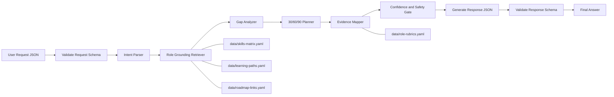

# Chloe Skills Agent

Role-grounded AI capability framework for IT organizations.

This repository helps your AI agent produce consistent, auditable, and low-hallucination recommendations for workforce capability planning.

## What This Solves
- Standardizes role expectations across IT functions.
- Produces evidence-based gap analysis and learning plans.
- Enforces structured outputs for reliable downstream automation.
- Supports customization without rewriting your core agent behavior.

## Supported Roles
- Software Engineer
- Product Owner / Product Manager
- Business Enablement
- Quality Assurance
- UI/UX Designer
- IT Infrastructure
- Network & Security
- Database Administrator
- Database Engineer
- AI Engineer
- DevOps / SRE
- Cloud Engineer
- IT Support / Service Desk
- Data Analyst
- Security Operations (SOC)

## Repository Map
- [agent/system-prompt.md](agent/system-prompt.md): Base behavior and guardrails for Chloe Skills Agent.
- [data/skills-matrix.yaml](data/skills-matrix.yaml): Role competencies, tools, and target proficiency.
- [data/roadmap-links.yaml](data/roadmap-links.yaml): Role-to-roadmap.sh mapping.
- [data/learning-paths.yaml](data/learning-paths.yaml): 30/60/90 execution plans per role.
- [data/role-rubrics.yaml](data/role-rubrics.yaml): Evidence-based role scoring rubric.
- [schemas/agent-request.schema.json](schemas/agent-request.schema.json): JSON Schema for runtime request validation.
- [schemas/agent-response.schema.json](schemas/agent-response.schema.json): JSON Schema for response contract validation.
- [USAGE-PLAYBOOK.md](USAGE-PLAYBOOK.md): Production workflow and anti-hallucination controls.
- [examples/sample-requests.md](examples/sample-requests.md): Prompt examples.
- [examples/request.sample.json](examples/request.sample.json): Structured request sample.
- [examples/response.sample.json](examples/response.sample.json): Structured response sample.

## Architecture Flow

## Quick Start
1. Load [agent/system-prompt.md](agent/system-prompt.md) as system prompt.
2. Add all YAML files in [data](data) as retrieval context.
3. Validate incoming request JSON against [schemas/agent-request.schema.json](schemas/agent-request.schema.json).
4. Execute pipeline from [USAGE-PLAYBOOK.md](USAGE-PLAYBOOK.md).
5. Validate output against [schemas/agent-response.schema.json](schemas/agent-response.schema.json) before returning to users.

## Copilot Chat vs Agent Mode
- Chat mode:
Use [.github/prompts/chloe-skills-agent.prompt.md](.github/prompts/chloe-skills-agent.prompt.md) when you want structured advisory output in one conversation.
- Agent mode:
Use [.github/prompts/chloe-skills-agent-mode.prompt.md](.github/prompts/chloe-skills-agent-mode.prompt.md) when you want Copilot Agent to run end-to-end workflow steps autonomously.
- Shared policy:
[.github/copilot-instructions.md](.github/copilot-instructions.md) applies in both modes.

## How To Run In Copilot Agent
1. Open this repository in VS Code.
2. Open Copilot Chat and switch to Agent mode.
3. Attach or reference [.github/prompts/chloe-skills-agent-mode.prompt.md](.github/prompts/chloe-skills-agent-mode.prompt.md).
4. Provide request payload using [examples/request.sample.json](examples/request.sample.json).
5. Require output validation using [schemas/agent-response.schema.json](schemas/agent-response.schema.json).

## JSON-First Runtime Contract
Use this request format:
- See [examples/request.sample.json](examples/request.sample.json)

Expect this response format:
- See [examples/response.sample.json](examples/response.sample.json)

Why this matters:
- JSON validation blocks malformed prompts and unstable output structures.
- Contract enforcement keeps orchestration deterministic and easier to test.

## Anti-Hallucination Principles
- Retrieval-only role facts from repository files.
- No-source no-claim: unsupported claims must be marked as assumptions.
- Evidence-first recommendations tied to rubric artifacts.
- Confidence gate: low-confidence output must ask clarification first.
- Bounded outputs for priorities, risks, and metrics.

## Customization Strategy
To adapt for your organization:
1. Edit role competencies in [data/skills-matrix.yaml](data/skills-matrix.yaml).
2. Tune sequencing in [data/learning-paths.yaml](data/learning-paths.yaml).
3. Update roadmap references in [data/roadmap-links.yaml](data/roadmap-links.yaml).
4. Tighten evidence requirements in [data/role-rubrics.yaml](data/role-rubrics.yaml).
5. Keep role keys consistent across all YAML and JSON schema enum values.

## Suggested Next Enhancements
1. Add certification mapping per role.
2. Build auto-scoring service from [data/role-rubrics.yaml](data/role-rubrics.yaml).
3. Add team-level heatmap and quarterly planning reports.
