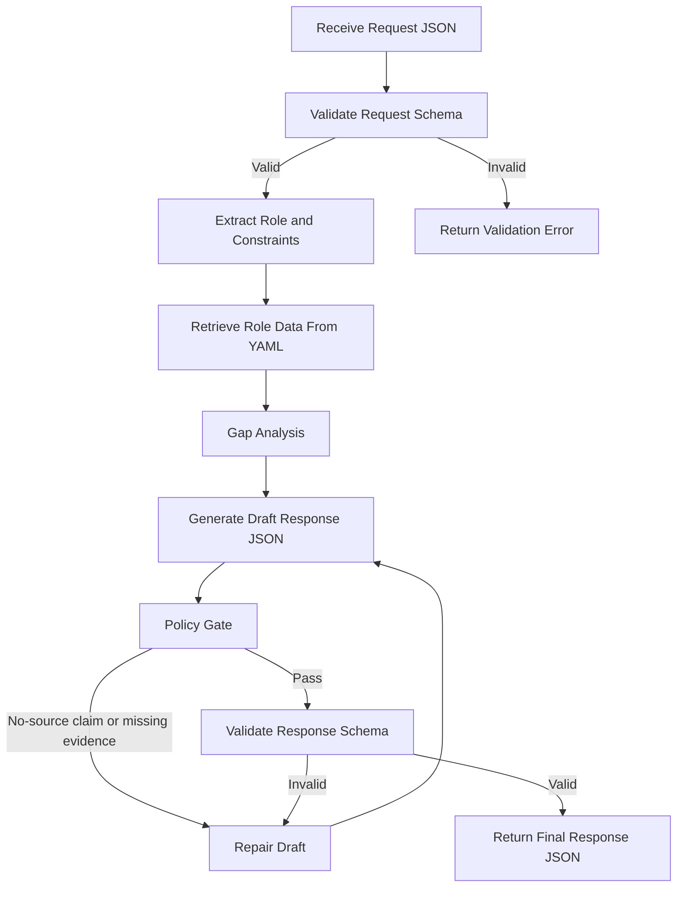

# End-to-End Process Example

This document shows a full run of Chloe Skills Agent with enforcement gates.

## Goal
Generate a role capability recommendation with low hallucination risk and schema-validated output.

## Inputs Used
- Request payload: [request.sample.json](request.sample.json)
- Role knowledge: [../data/skills-matrix.yaml](../data/skills-matrix.yaml)
- Learning path: [../data/learning-paths.yaml](../data/learning-paths.yaml)
- Roadmap mapping: [../data/roadmap-links.yaml](../data/roadmap-links.yaml)
- Evidence rubric: [../data/role-rubrics.yaml](../data/role-rubrics.yaml)
- Request schema: [../schemas/agent-request.schema.json](../schemas/agent-request.schema.json)
- Response schema: [../schemas/agent-response.schema.json](../schemas/agent-response.schema.json)

## Flow

## Step-by-Step Run
1. Validate request with request schema.
Outcome: if invalid, return field-level errors and stop.

2. Resolve role key from request.
Example: `ai_engineer`

3. Load only matching role sections from data files.
Outcome: role-grounded context only, no generic expansion.

4. Build gap analysis from current evidence vs expected capabilities.
Outcome: ranked gap list by impact.

5. Generate 30/60/90 plan and KPI targets.
Outcome: bounded recommendations with measurable targets.

6. Run policy checks.
Rules:
- No-source no-claim.
- Every major recommendation has an evidence artifact.
- Max 5 priorities and max 3 risks.

7. Validate response against response schema.
Outcome: if invalid, repair and re-validate.

8. Return final JSON.
Example final output: [response.sample.json](response.sample.json)

## Fail Case Examples
### A) Invalid Request
Input has `timeline_days: 7`.
Schema result: fails minimum value constraint.
Action: return validation error, ask user for timeline >= 30.

### B) Invalid Response
Model returns 7 priorities.
Policy result: exceeds limit.
Action: trim or re-rank to top 5 and re-validate.

### C) Unsupported Claim
Model suggests certification not present in repository data.
Policy result: unsupported claim.
Action: move to assumptions or remove claim.

## Suggested Runtime Prompt
Use one of these:
- Chat: [../.github/prompts/chloe-skills-agent.prompt.md](../.github/prompts/chloe-skills-agent.prompt.md)
- Agent: [../.github/prompts/chloe-skills-agent-mode.prompt.md](../.github/prompts/chloe-skills-agent-mode.prompt.md)

## Minimum Completion Criteria
A run is considered successful only if all are true:
1. Request passes schema validation.
2. Role data is found in all required YAML files.
3. Response passes policy checks.
4. Response passes schema validation.
5. Output includes confidence, assumptions, and unknowns.
